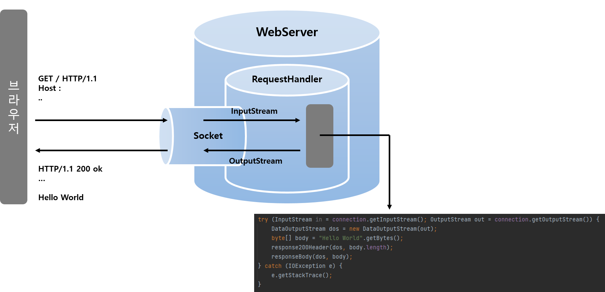

# 웹 서버 시작
### WebServer.java 
```java
public class WebServer {
    private static final int DEFAULT_PORT = 8080;

    // 실행하면 서버 켜짐
    public static void main(String args[]) throws Exception {
        int port = 0;
        if (args == null || args.length == 0) {
            port = DEFAULT_PORT;
        } else {
            port = Integer.parseInt(args[0]);
        }

        // 서버소켓을 생성한다.
        // 8080번 포트를 사용
        try (ServerSocket listenSocket = new ServerSocket(port)) {
            System.out.println("Web Application Server started {} port.... "+ port);

            // 클라이언트가 연결될때까지 대기
            Socket connection;
            while ((connection = listenSocket.accept()) != null) {
                RequestHandler requestHandler = new RequestHandler(connection);
                requestHandler.start();
            }
        }
    }
}
```
### RequestHandler.java
```java
public class RequestHandler extends Thread {

    private Socket connection;

    public RequestHandler(Socket connectionSocket) {
        this.connection = connectionSocket;
    }

    public void run() {
        System.out.println("New Client Connect! Connected IP : {"+ connection.getInetAddress()+"}, Port : {"+connection.getPort()+"}");

        try (InputStream in = connection.getInputStream(); OutputStream out = connection.getOutputStream()) {
            DataOutputStream dos = new DataOutputStream(out);
            byte[] body = "Hello World".getBytes();
            response200Header(dos, body.length);
            responseBody(dos, body);
        } catch (IOException e) {
            e.getStackTrace();
        }
    }

    private void response200Header(DataOutputStream dos, int lengthOfBodyContent) {
        try {
            dos.writeBytes("HTTP/1.1 200 OK \r\n");
            dos.writeBytes("Content-Type: text/html;charset=utf-8\r\n");
            dos.writeBytes("Content-Length: " + lengthOfBodyContent + "\r\n");
            dos.writeBytes("\r\n");
        } catch (IOException e) {
            e.getStackTrace();
        }
    }

    private void responseBody(DataOutputStream dos, byte[] body) {
        try {
            dos.write(body, 0, body.length);
            dos.flush();
        } catch (IOException e) {
            e.getStackTrace();
        }
    }
}
```

### 동작 방식



## 과제 1. index.html 응답하기
```java
try (InputStream in = connection.getInputStream(); OutputStream out = connection.getOutputStream()) {

    // http 요청 정보를 모두 출력
    InputStreamReader inputStreamReader = new InputStreamReader(in);
    BufferedReader bufferedReader = new BufferedReader(inputStreamReader);
    int idx = 0;
    while (bufferedReader.ready()){
        // 요청 url 정보 찾기
        System.out.println(idx+"   "+bufferedReader.readLine());
        idx++;
    }

    DataOutputStream dos = new DataOutputStream(out);
    byte[] body = "Hello World".getBytes();
    response200Header(dos, body.length);
    responseBody(dos, body);
} catch (IOException e) {
    e.getStackTrace();
}
```
출력 결과
```
0   GET /asdfasd/asdfasdfs/index.html HTTP/1.1
1   Host: localhost:8080
2   Connection: keep-alive
3   Cache-Control: max-age=0
4   sec-ch-ua: " Not;A Brand";v="99", "Google Chrome";v="97", "Chromium";v="97"
5   sec-ch-ua-mobile: ?0
6   sec-ch-ua-platform: "Windows"
7   Upgrade-Insecure-Requests: 1
8   User-Agent: Mozilla/5.0 (Windows NT 10.0; Win64; x64) AppleWebKit/537.36 (KHTML, like Gecko) Chrome/97.0.4692.99 Safari/537.36
9   Accept: text/html,application/xhtml+xml,application/xml;q=0.9,image/avif,image/webp,image/apng,*/*;q=0.8,application/signed-exchange;v=b3;q=0.9
10   Sec-Fetch-Site: none
11   Sec-Fetch-Mode: navigate
12   Sec-Fetch-User: ?1
13   Sec-Fetch-Dest: document
14   Accept-Encoding: gzip, deflate, br
15   Accept-Language: ko-KR,ko;q=0.9,en-US;q=0.8,en;q=0.7
```
첫번째 라인에 요청 URL 정보가 담겨있는것 확인 <br/>

첫번째 라인 문자열을 분리하여 작업 예정... 생각보다 어렵다...

## 과제 2. Get 방식으로 회원가입
## 과제 3. Post 방식으로 회원가입
## 과제 4. redirect 방식으로 이동
## 과제 5. cookie
## 과제 6. stylesheet 적용
